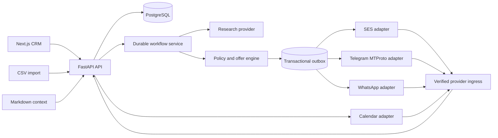
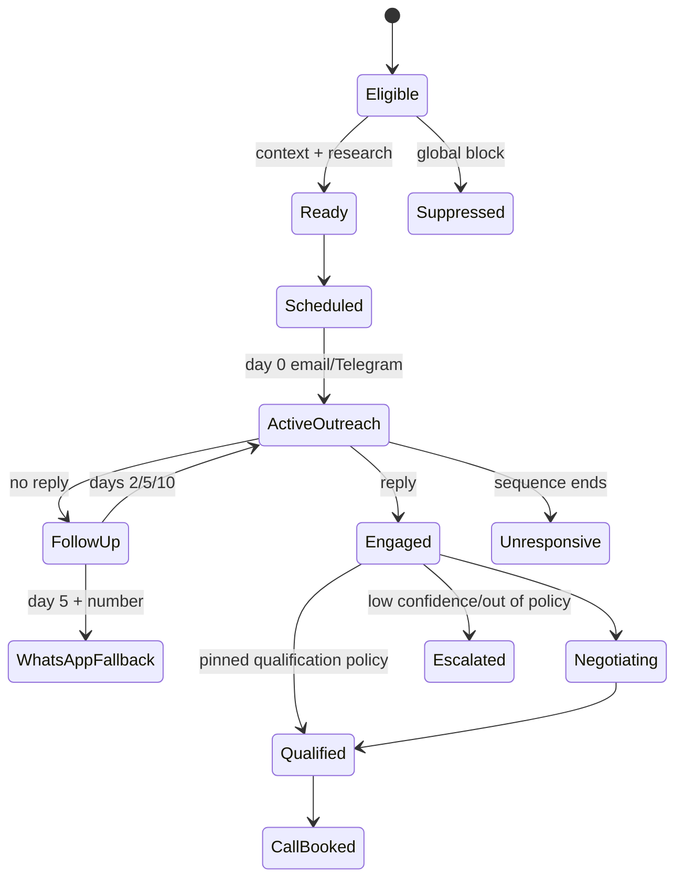

# Architecture

## Design principle

LLMs may propose research summaries, personalization, replies, and negotiation strategy, but they do not control timing, credentials, prices, inventory, suppression, or provider sends. Deterministic application code owns those decisions.



The current worker stores durable timers and outbox records in PostgreSQL. Its contracts are compatible with moving timer orchestration to Temporal without moving authorization or side effects into model code.

## Canonical ownership

- `EventLead` is the per-event sales relationship.
- `Contact` owns normalized channel identities.
- `ContextVersion` is the immutable source of event and commercial truth for a conversation.
- `ScheduledAction` describes intended future work.
- `OutboxEvent` is the only dispatchable provider side effect.
- `Conversation` and `Message` form the unified channel timeline.
- `PackageInventory` is event/package scoped, not context-version scoped.
- `Offer` records the exact context, price, discount, perks, state, and expiry.
- `ProviderEvent` is the replay claim for normalized inbound events.
- `TimelineEvent` explains prospect, system, and policy activity.
- `AuditEvent` explains privileged operator activity.

## Context compilation

```text
contexts/
  organization/
    company.md
    voice-and-style.md
  events/<slug>/
    event.md
    audience.md
    packages.md
    negotiation-policy.md
    inventory.md
    faq.md
    qualification.md
    escalation.md
```

Activation locks the event, validates all files together, hashes the complete document set, assigns a monotonic version, and updates the event-scoped inventory ledger under a row lock. Existing leads remain pinned to their original context version.

Validation covers missing files, malformed front matter, duplicate package IDs, invalid prices, package floors that exceed the maximum discount, currency, perk/escalation list types, expiry, unknown inventory packages, missing inventory, and attempts to reduce stock below active reservations.

## Import and identity flow

1. Hash and atomically claim `(event_id, file_hash)`.
2. Preserve each original row and row fingerprint.
3. Normalize email, Telegram username, optional WhatsApp, timezone, and sponsor answer.
4. Admit only exact case/whitespace-normalized `yes` or `maybe`.
5. Check global suppression identities.
6. Resolve email and Telegram as primary identities; treat WhatsApp as a supporting conflict signal.
7. Quarantine mismatched identities rather than merging them.
8. Atomically claim contact and event-lead uniqueness.

## Outreach state and timing



`next_local_window` converts logical UTC time to the contact timezone and schedules only inside the configured local interval. Event cutoff, suppression, automation status, reply state, context, research confidence, and channel identity are rechecked before enqueue and immediately before dispatch.

## Send and reply serialization

Every enqueue, dispatch, reply, suppression, pause, and takeover uses the same database lock order:

1. Lead.
2. Scheduled action.
3. Outbox record.

Dispatch holds this fence through provider acceptance and persistence. If a reply commits first, dispatch observes cancelled work and cannot send. If dispatch acquired the fence first, the reply waits until that send has a definitive result and then cancels all later work. Provider idempotency keys protect retries after ambiguous transport failures.

## Telegram quota

The database ledger is keyed by a single configured account quota date, not by prospect timezone. Reservation takes a row lock and admits a new contact only while `reserved_count < limit_count`. The configured limit has a hard validation maximum of 20; it may be lowered. Quota is consumed at enqueue and is not returned after a transport failure, favoring safety over throughput.

Follow-ups to an existing Telegram conversation do not use the new-contact ledger. Overflow is moved to the next prospect-local contact window, and later follow-ups anchor to the actual Telegram dispatch time.

## Replies and qualification

Normalized inbound messages atomically claim `(provider, provider_event_id)` before mutation. If one identity has several active event relationships, the ingress adapter must provide `lead_id`; the service refuses to guess.

Reply intent is classified into opt-out/rejection, call request, interest with tier, interest, question, or uncertain. The pinned qualification metadata controls whether explicit call readiness and interest-plus-tier qualify automatically. Disabled qualification paths escalate instead of booking.

A qualified lead receives provider-neutral slots. A reply selecting first/second/third or an explicit offered timestamp books idempotently and records the meeting.

## Offer and inventory lifecycle

The context defines list price, floor, maximum discount, package perks, allowed custom perks, forbidden promises, expiry, and escalation rules. The deterministic engine validates an offer before an event/package inventory row can be reserved.

- Identical active offers are idempotent.
- A replacement offer for the same package releases the previous reservation before reserving the replacement under the same row lock.
- Expired, declined, lost, unresponsive, and suppressed offers release stock.
- `won` requires a specific accepted offer ID, retains that unit as consumed capacity, and releases alternative offers.
- Context edits never create fresh physical inventory.

## Trust boundaries

- Browser/operator requests are authorized by management API keys in exposed environments; role headers are local-test conveniences only when no key is configured.
- Provider-specific ingress must verify the provider’s official signature and normalize the event.
- The normalized callback is then signed with `HMAC-SHA256(secret, timestamp + "." + raw_body)` and rejected outside a five-minute window.
- External pages, CSV text, and prospect content are untrusted data, not agent instructions.
- Live provider mode has no fallback to fake sends.
