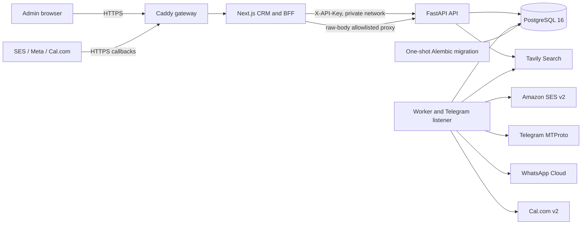

# SponsorFlow technical reference

This document is the code-accurate reference for SponsorFlow `0.1.0`. It describes the behavior implemented in this repository, distinguishes local guarantees from provider guarantees, and records operational gaps that must be addressed before production outreach. The shorter documents in this directory remain the deployment, provider-validation, security, and acceptance runbooks.

## 1. Purpose, scope, and non-goals

SponsorFlow imports event registrants who explicitly answered `yes` or `maybe` to sponsorship interest, pins each lead to approved event context, performs cited business research, schedules policy-controlled outreach, normalizes replies and delivery events, validates offers against pricing and inventory policy, and books calls. It exposes a FastAPI management API and a shared-admin Next.js CRM.

The current product is deliberately deterministic:

- Message composition uses templates in `backend/app/workflows.py`.
- Inbound intent classification uses phrase and package-name matching in `backend/app/operations.py`.
- Tavily is used only as a search provider. Search result titles, URLs, snippets, retrieval time, and confidence metadata are stored as research facts.
- There is **no LLM client, autonomous agent loop, model-based negotiation engine, or generative conversation planner** in this codebase.
- “Fake” providers are simulation adapters for development and tests. Production configuration rejects fake provider mode.

SponsorFlow is not currently a multi-tenant application, a provider-agnostic messaging bus, a complete legal-retention system, or a substitute for production backup, monitoring, and incident-response infrastructure.

## 2. Runtime topology and trust boundaries

The production Compose topology consists of:

| Service | Exposure and responsibility |
|---|---|
| `gateway` | The only service binding host ports 80/443. Caddy terminates TLS, redirects/provisions certificates, compresses responses, adds HSTS, `nosniff`, and same-origin referrer policy, and forwards all traffic to the CRM. |
| `crm` | Next.js UI, password login, management BFF, and allowlisted provider-webhook proxy. It is private to the Compose network. |
| `api` | FastAPI management and callback application. It is private to the Compose network. |
| `worker` | Polls durable actions/outbox records and owns the Telegram listener. It is private and reports durable heartbeats. |
| `migrate` | Runs `alembic upgrade head` once after PostgreSQL becomes healthy; API and worker wait for successful completion. |
| `postgres` | System of record. It is not published to the host by production Compose. |

### Trust boundaries

1. **Public browser boundary.** The CRM uses one server-side admin password. A successful login creates a signed, 12-hour, `HttpOnly`, `SameSite=Strict` cookie; it is `Secure` in production. The browser never receives the backend API key.
2. **CRM-to-API boundary.** `/api/backend/[...path]` verifies the session cookie, attaches the server-only admin API key and `X-Actor: web-admin`, and proxies the body. Consequently, the current UI always acts as an administrator even though the backend supports three roles.
3. **Provider callback boundary.** `/api/webhooks/[...path]` does not require a CRM session. It only allows `ses/events`, `whatsapp`, and `calcom`, preserves the raw request body and required signature headers, and forwards to native backend callback routes.
4. **Normalized callback boundary.** `/api/v1/inbound` and `/api/v1/inbound/delivery` use a separate HMAC-SHA256 signature over `timestamp + "." + raw_body`; timestamps outside five minutes are rejected.
5. **Database boundary.** Provider credentials are encrypted before storage. The provider encryption key, API keys used to bootstrap management access, web password, session secret, database password, and callback HMAC key remain deployment secrets.
6. **Provider boundary.** Native SES, Meta, and Cal.com callbacks are authenticated with their provider-specific signatures. Outbound provider calls can produce definite, retryable, terminal, or ambiguous outcomes; local correlation keys do not create a provider-side exactly-once guarantee.

The login limiter is an in-process map keyed by the last `X-Forwarded-For` value (or `unknown`): five failures per 15 minutes. It is neither shared across CRM replicas nor durable across restarts.

## 3. Repository and module map

| Path | Responsibility |
|---|---|
| `backend/app/main.py` | FastAPI routes, API-key RBAC, callback authentication, provider readiness checks, response shaping, and management operations. |
| `backend/app/models.py` | SQLAlchemy ORM schema and database constraints. |
| `backend/app/schemas.py` | Pydantic request and response contracts. |
| `backend/app/database.py` | Engine, session factory, dependency wiring, and non-production schema creation. |
| `backend/app/importer.py` | CSV parsing, mapping detection, normalization, eligibility, deduplication, quarantine, suppression checks, and row provenance. |
| `backend/app/context.py` | Markdown/front-matter parsing, context validation, canonical hashing, immutable versions, and inventory initialization. |
| `backend/app/research.py` | Fake and Tavily research providers, citation shaping, confidence, and cache keys. |
| `backend/app/policy.py` | Send policy, global suppression lookup, Telegram quota reservation, and offer validation. |
| `backend/app/workflows.py` | Workflow start, scheduling, action-to-outbox enqueue, dispatch, message composition, retries, and worker-cycle orchestration. |
| `backend/app/operations.py` | Inbound replies, delivery reconciliation, suppression, offer inventory, meeting lifecycle, manual takeover, and auditing. |
| `backend/app/adapters.py` | Fake, SES, Telegram/Telethon, WhatsApp Cloud, Cal.com, and provider-registry implementations. |
| `backend/app/provider_config.py` | Provider definitions, encrypted credentials, optimistic revisions, readiness checks, and runtime settings overlay. |
| `backend/app/sns.py` | SNS signature verification, subscription confirmation, SES inbound MIME parsing, and correlation checks. |
| `backend/app/worker.py` | Poll loop, heartbeat, Telegram advisory-lock ownership, inbound listener, and durable update cursors. |
| `backend/alembic/` | Production migration entrypoint and revisions. |
| `backend/tests/` | API, policy, workflow, integration, RBAC/security, and PostgreSQL concurrency tests. |
| `frontend/app/` | App Router pages and server route handlers. |
| `frontend/lib/server-auth.ts` | Signed session token and constant-time password verification. |
| `contexts/` | Organization and event Markdown examples consumed through the context API/UI. |
| `docker-compose.production.yml` | Host-ready service topology. |
| `Caddyfile` | Public TLS gateway and security headers. |

## 4. Frontend, BFF, and authentication

### Browser routes

| Route | Current purpose |
|---|---|
| `/` | Dashboard and event overview. |
| `/events/[id]` | Event workspace: context, imports, campaigns, simulation/launch, and export. |
| `/leads` | Filterable lead pipeline. |
| `/leads/[id]` | Conversation, timeline, research, schedules, automation controls, offers, meetings, and manual reply. |
| `/operations` | Operational queues, suppressions, audit events, and aggregate status. |
| `/providers` | Admin provider configuration, tests, and Telegram authorization. |
| `/login` | Shared-admin password login. |

Server route handlers are:

- `/api/auth/login` and `/api/auth/logout`: session-cookie lifecycle.
- `/api/backend/[...path]`: authenticated management BFF. It forwards GET, POST, PUT, PATCH, and DELETE and always uses the backend admin key.
- `/api/webhooks/[...path]`: unauthenticated-at-CRM but allowlisted raw-body callback proxy; backend provider signatures remain mandatory.

The management BFF currently returns only the upstream `Content-Type` header. It drops other response headers, including CSV `Content-Disposition`. The event UI performs imports with its built-in/default mapping path; it does not expose a complete interactive mapping-preview workflow. The lead page explicitly requests `{provider: "fake"}` for manual research, which production rejects, and includes an unused `provider` field when requesting a meeting (Pydantic ignores it). These are known UI integration defects, not backend contracts.

### Backend roles

The backend compares `X-API-Key` in constant time against configured keys and derives the role from the matching key:

| Role | Access |
|---|---|
| `viewer` | Authenticated reads. |
| `operator` | Reads and ordinary writes. |
| `admin` | Reads, writes, provider credentials, provider tests, Telegram authorization, and suppression removal. |

When no management keys are configured outside production, local/test requests default to admin and may use `X-Role` for RBAC tests. Production always requires a valid key. The UI does not expose viewer/operator sessions.

## 5. Data model and integrity constraints

All application identifiers are UUID strings unless a table uses a natural/composite key. Most lifecycle labels are strings rather than database enums; application validation is therefore important.

| Model | Purpose and important constraints |
|---|---|
| `Event` | Event name, slug, timezone, start, cutoff, and status. `slug` is unique. |
| `ContextVersion` | Original documents plus compiled policy snapshot. Unique `(event_id, version)` and `(event_id, content_hash)`; campaign/offer references restrict deletion. |
| `Campaign` | Event/context pairing, status, follow-up days, and WhatsApp fallback day. |
| `ImportJob` | File claim, mapping, summary, and status. Unique `(event_id, file_hash)` prevents duplicate file processing per event. |
| `ImportRow` | Raw and normalized row provenance, fingerprint, outcome, and reason. Unique `(import_job_id, row_number)`. |
| `Contact` | Cross-event person/organization identity. Normalized email and Telegram are independently unique; WhatsApp is indexed but not declared unique. |
| `EventLead` | Event/contact relationship, campaign/context pins, sponsor answer, pipeline state, delivery state, automation state, qualification and reply timestamps. Unique `(event_id, contact_id)`. |
| `SuppressionEntry` | Identity-level global block. Unique `(identity_type, identity_value, scope)`. |
| `ResearchReport` | Provider, summary, cited facts, fit angles, confidence, and cache key for a lead. |
| `Conversation` | One conversation per lead, preferred channel, status, and summary. `lead_id` is unique. |
| `Message` | Inbound/outbound message with provider IDs, local idempotency key, context pin, and provenance. Unique `(provider, provider_message_id)` and unique local `idempotency_key`. |
| `TimelineEvent` | Lead-scoped chronological policy/business event. |
| `ScheduledAction` | Due work item with type, channel, attempts, payload, status, and cancellation reason. `idempotency_key` is unique; `(status, due_at)` is indexed. |
| `OutboxEvent` | Durable send envelope and retry/reconciliation state. `idempotency_key` is unique. |
| `ProviderConfig` | One row per provider, public configuration, AES-GCM ciphertext/nonce/key version, optimistic revision, actor, and last check. |
| `ProviderEvent` | Replay claim for inbound/delivery/calendar events. Unique `(provider, provider_event_id)`. |
| `WorkerHeartbeat` | Durable health record keyed by component name (`worker`, `telegram_listener`). |
| `TelegramUpdateCursor` | Last processed message ID keyed by `(provider_account_id, chat_id)`. |
| `TelegramDailyQuota` | Account-wide reservation ledger keyed only by quota date. |
| `PackageInventory` | Event/package total and reserved counts. Unique `(event_id, package_id)`. |
| `Offer` | Context-pinned package proposal, prices, discount, perks, status, rationale, and expiry. |
| `Meeting` | Provider booking correlation and lifecycle. Unique `(provider, provider_booking_id)`. |
| `AuditEvent` | Operator/system action, resource, structured details, and timestamp. |

There are 23 ORM entities. Referential actions intentionally cascade event-owned records in some paths and restrict deletion where historical context must remain valid. The code does not implement a general hard-delete API.

## 6. Implemented lifecycles

### 6.1 Lead state

`EventLead.state` is a string. The PATCH API accepts the following labels:

`eligible`, `researching`, `ready`, `email_sent`, `telegram_queued`, `active_outreach`, `followup_due`, `whatsapp_fallback`, `engaged`, `qualified`, `negotiating`, `escalated`, `call_booked`, `won`, `lost`, `unresponsive`, `suppressed`.

This list is not a fully implemented automatic state machine. Actual automatic assignments are:

- Import creates `eligible` leads.
- Research sets `ready`.
- First workflow start keeps/sets `ready` and sets delivery state to `scheduled`.
- Low research confidence, uncertain replies, qualification-policy conflicts, or invalid offers set `escalated`.
- An inbound message initially sets `engaged`; deterministic classification may then set `qualified`, `escalated`, `call_booked`, or `suppressed`.
- A valid offer sets `negotiating`.
- Successful meeting booking or an active booking callback sets `call_booked`; cancellation/rejection can return it to `qualified`.
- Operators set `won`, `lost`, and `unresponsive`; global suppression sets `suppressed` for every lead belonging to the contact.

The code does **not** automatically assign several declared labels, including `email_sent`, `telegram_queued`, `active_outreach`, `followup_due`, and `whatsapp_fallback`. It does not automatically complete campaigns or mark silent leads unresponsive. Terminal state changes cancel pending/queued outreach and stop automation. Winning requires an active `accepted_offer_id` belonging to the lead.

`automation_status` uses `active`, `paused`, `manual`, or `stopped`. Manual reply cancels pending automation, changes the lead to `manual`, and queues a `manual_reply` action. Resuming can re-open selected action cancellations, but terminal leads must be explicitly reopened before automation can resume.

### 6.2 Scheduled action and outbox

```mermaid
stateDiagram-v2
    [*] --> pending: schedule action
    pending --> queued: policy passes; outbox created
    pending --> pending: local window or quota deferral
    pending --> cancelled: policy or prerequisites fail
    queued --> sent: provider returns definite success
    queued --> failed: terminal or exhausted retryable failure
    queued --> ambiguous: ambiguous or unknown provider outcome
    queued --> cancelled: reply, suppression, terminal state, or policy fence
```

Outbox status is `pending`, `processed`, `failed`, `cancelled`, or `reconcile_required`. A send cycle:

1. Selects due `pending` actions.
2. Locks and re-reads the lead and action.
3. Evaluates eligibility, automation, terminal state, prior reply, suppression, event cutoff, contact-local daytime, and action status.
4. Reschedules only a daytime-window failure; other policy failures cancel the action.
5. Reserves a Telegram slot when required.
6. Requires pinned context, research, sufficient confidence, and a destination identity.
7. Creates one local outbox record keyed by `send:<action_id>` and marks the action queued.
8. Dispatch locks lead → action → outbox, repeats policy checks, performs the provider call, then records the outbound message and timeline.

Provider network I/O occurs while these database row locks remain held. This preserves the reply/send fence used by the implementation but can increase lock duration and reduce throughput.

Retry semantics are:

- `RetryableProviderError`: exponential backoff, maximum three attempts by default; an explicit provider delay permits up to ten attempts.
- `TerminalProviderError`: fail immediately.
- `AmbiguousProviderError` or any unknown exception: stop automatic replay, set outbox to `reconcile_required`, and action to `ambiguous`.

No automated queue consumes `reconcile_required`. A verified delivery callback may reconcile an SES send through the local idempotency tag. Otherwise an operator must investigate. Local unique keys prevent duplicate local queue/message creation; live providers do not uniformly honor them as native idempotency keys.

### 6.3 Offer lifecycle

A proposed offer is validated against the lead’s pinned context: package existence, minimum price, maximum discount, allowed perks, forbidden promises, mandatory escalation phrases, and compiled inventory. A valid new offer row-locks inventory, reserves one unit, gets an expiry, sets the lead to `negotiating`, and starts as `proposed`. Sending changes it to `queued` and creates a conversation action.

An equivalent active offer is reused. A different active proposal for the same package is replaced and releases its reservation. Expired offers are released at each worker cycle. Suppression and terminal outcomes release non-winning reservations. A `won` transition marks the selected offer `accepted` and declines/releases competing offers; `lost` and `unresponsive` release active offers. Provider delivery of an offer message does not itself mean prospect acceptance.

### 6.4 Meeting lifecycle

The calendar adapter lists candidate slots and books a selected/requested time. Local correlation is `meeting:<lead_id>:<starts_at>`, while provider uniqueness is `(provider, provider_booking_id)`. A successful booking creates a `Meeting` and sets the lead to `call_booked`.

Cal.com callbacks normalize created/confirmed, rescheduled, cancelled, rejected, completed, no-show, and reopened events. Rescheduling can create a replacement meeting and mark the old one `superseded`. If no active booked/rescheduled meeting remains after cancellation or rejection, a `call_booked` lead returns to `qualified`.

Cal.com metadata supports correlation but is not a native provider idempotency guarantee. A conflict during reply-driven booking returns refreshed slots and keeps the lead qualified.

## 7. End-to-end workflows

### 7.1 CSV admission

1. Preview decodes UTF-8 with BOM support, returns headers, five sample rows, detected mapping, and SHA-256 file hash.
2. Import claims `(event_id, file_hash)` so concurrent duplicate uploads return the winning job.
3. Required mapped values are name, valid email, Telegram, and sponsorship answer. Email, Telegram, phone, whitespace, and answer are normalized.
4. Only normalized exact `yes` and `maybe` are eligible. Every other answer becomes `no` and is ineligible.
5. Existing global suppressions are checked before and after identity locking.
6. Email and Telegram identify a cross-event contact. Conflicting identity ownership is quarantined rather than merged. WhatsApp is supporting identity and conflicts are also quarantined.
7. A contact can have one lead per event. Each source row records raw data, normalized data, fingerprint, outcome, and reason.

Outcomes are `eligible`, `ineligible`, `duplicate`, `suppressed`, `invalid`, and `quarantined`.

### 7.2 Context activation

The API accepts a map of Markdown documents. Required event documents are `event.md`, `audience.md`, `packages.md`, `negotiation-policy.md`, `inventory.md`, `faq.md`, `qualification.md`, and `escalation.md`; organization documents are `company.md` and `voice-and-style.md`.

Compilation validates front matter, package IDs and prices, the relationship between minimum prices and the maximum discount, currency, perks and escalation lists, inventory references/counts, offer expiry, and event name. Activation locks the event, hashes canonical document JSON, reuses an identical version, otherwise increments the version and initializes/updates inventory. Inventory cannot be reduced below active reservations. There is no context mutation endpoint; campaigns and offers retain their version pins.

### 7.3 Research

Fake research derives cited facts from imported contact data. Tavily sends a business-profile query to `/search` with Bearer authentication, requests 1–10 results at basic or advanced depth, disables answer and raw-content retrieval, and stores bounded result excerpts and source URLs. Provider readiness checks use Tavily `/usage`.

Reports are cached per lead using provider and contact/search configuration. Live workflow start requires a report from the configured live research provider. Dispatch repeats that provider-match check. Confidence below `minimum_research_confidence` cancels the action and escalates the lead.

### 7.4 Outreach

Workflow start requires an active campaign, eligible and active non-terminal lead, matching event, consistent campaign/context pins, and research. It schedules only:

- day 0 `initial_email` at the next contact-local outreach window;
- day 0 `initial_telegram` five minutes later.

Follow-ups are created **only after the initial Telegram send succeeds**. Campaign `followup_days` determine delays from that success. Channels alternate Telegram/email by sequence; if a follow-up day equals `whatsapp_fallback_day` and the contact has WhatsApp, that action becomes `whatsapp_fallback`. There is no automatic follow-up plan when initial Telegram fails or remains ambiguous.

Composition is deterministic and records `composer: deterministic-v1`, research report ID, context version, and policy checks in message provenance.

### 7.5 Replies and suppression

Provider events are first claimed by `(provider, provider_event_id)` for replay safety. Identity is normalized to a contact. If one identity has multiple active event leads, the callback must provide `lead_id`; any provided lead ID must belong to that contact.

An inbound message creates a unified conversation/message record, changes preferred channel, locks the lead, cancels pending/queued outreach, and applies deterministic classification:

- opt-out phrases globally suppress every event lead and identity for the contact;
- explicit call requests or interest plus a named tier qualify only when compiled policy permits, then return calendar slots;
- the same intents escalate when qualification policy requires a human;
- generic interest requests a tier preference;
- questions return compiled package names and list prices;
- uncertain text escalates without an automatic response;
- a qualified lead’s selection of a previously offered slot attempts booking.

Global suppression creates entries for email, Telegram, and available WhatsApp, stops all related leads, releases active offers, and cancels pending sends. Admin removal deletes suppression entries but deliberately does not resume automation.

### 7.6 Delivery reconciliation

Delivery callbacks claim provider events, append a bounded delivery history, and ignore regressive status/time updates for current-state purposes. Status rank progresses through accepted/delayed/delivered/read and terminal failures. SES complaints and permanent bounces trigger global suppression.

A verified SES event carrying the local `sponsorflow_id` can materialize the message and mark an ambiguous outbox/action successful when the provider accepted the send but the original request did not return definitively.

## 8. Telegram hard quota

`telegram_daily_new_contact_limit` validates from 1 through 20, so configuration may lower but cannot raise the hard cap. Only `initial_telegram` reserves quota; follow-ups and conversation/manual replies do not.

The algorithm is:

1. Convert current UTC time to `telegram_quota_timezone` (falling back to UTC if invalid) and select that date.
2. Row-lock the date’s `TelegramDailyQuota`; safely initialize it under a nested transaction if absent.
3. Preserve the lower of the day’s stored limit and current configuration, so raising configuration mid-day cannot increase that day’s cap.
4. If full, defer the action to the next contact-local outreach window on the following day.
5. Otherwise increment `reserved_count` in the action-enqueue transaction.

Reservations are conservative: they are not returned after cancellation, provider failure, ambiguity, or suppression. This can under-use the daily maximum but prevents accidental over-contact. The ledger key contains no provider account ID, so the current schema and runtime assume one Telegram account.

PostgreSQL row locks provide the intended concurrency guarantee. SQLite is for local exploration only and must not be used to claim production lock behavior.

## 9. Provider control plane and credential encryption

Supported provider records are `ses`, `telegram`, `whatsapp`, `calcom`, and `tavily`. The admin API publishes field descriptors and booleans indicating whether secret fields exist; it never returns secret values.

Provider updates:

- reject unknown configuration/secret fields;
- validate required fields before enablement;
- restrict Cal.com and Tavily base URLs to their official HTTPS hosts;
- require `expected_revision` for updates and row-lock the current row;
- merge supplied secrets, explicitly clear requested secrets, encrypt the complete secret map, increment revision, and clear previous check results;
- audit only changed field names and revision/status, not secret values.

Secrets use AES-256-GCM with a random 12-byte nonce. `SPONSORFLOW_PROVIDER_ENCRYPTION_KEY` must decode from URL-safe base64 to exactly 32 bytes. Additional authenticated data is `<provider>:v<key_version>`, binding ciphertext to provider and key-version context. Current rows use key version 1.

There is no implemented key-rotation/re-encryption workflow. Losing the key makes stored provider credentials unreadable; rotating it requires an operator-designed migration. Back up the key separately from the database under controlled secret management.

Provider rows overlay environment defaults at runtime and are fingerprinted by provider revision/enabled state. Environment provider values remain a recovery/bootstrap path, but the production UI is the normal account-configuration path.

## 10. Provider contracts

### 10.1 Fake adapters

Fake messaging/calendar/research are deterministic local simulation. Campaign simulation advances logical time through days 0, 2, 5, and 10. Production settings reject `provider_mode=fake`, and the explicit fake research request is rejected in production.

### 10.2 Amazon SES v2 and SNS

Outbound email uses SES v2, a verified sender, configuration set, and plus-addressed Reply-To for lead correlation. The local outbox key is passed as provider metadata/tagging; it is correlation, not SES request idempotency. Ambient AWS credentials/task roles are preferred, while encrypted static credentials are supported.

The native `/webhooks/ses/events` endpoint:

- verifies the SNS certificate/signature and pins the exact configured topic ARN;
- confirms valid subscription requests;
- parses notification payloads and maps send, delivery, delay, bounce, complaint, reject, and rendering failure;
- parses received MIME mail under configured size/identity constraints;
- requires reply correlation and validates envelope identity before accepting a lead match;
- quarantines sender/correlation mismatches rather than attaching them to a lead;
- globally suppresses complaints and bounces classified as permanent.

Exact infrastructure wiring, receipt rules, configuration-set destinations, and validation steps are in [Provider validation](provider-validation.md).

### 10.3 Telegram through Telethon

Telegram uses a personal-account MTProto session. Admin authorization stores API hash and the final Telethon `StringSession` encrypted at rest; login start temporarily stores pending session/code-hash state, and confirmation supports Telegram 2FA password requests.

The worker owns both polling and the listener. On PostgreSQL, the listener holds one session-level advisory lock named `sponsorflow.telegram.listener`, allowing one active listener owner. Provider account and chat qualify inbound IDs. Durable per-account/per-chat cursors are advanced transactionally; first observation establishes a nonprocessing baseline, replay is bounded to 1,000 messages, and flood-wait delays are represented as retryable provider delays.

The implementation assumes one configured Telegram account for quota purposes. Running the listener with SQLite does not provide cross-process advisory-lock ownership.

### 10.4 WhatsApp Business Cloud

Initial/fallback outreach uses a configured approved template and language; template body parameters depend on `template_body_mode`. Conversation replies can use free-form messages inside Meta’s permitted customer-service window. Outbound response IDs become provider message IDs.

GET `/webhooks/whatsapp` performs Meta verify-token challenge. POST verifies `X-Hub-Signature-256` HMAC over the raw body, then normalizes text, interactive titles, image/document captions, and sent/delivered/read/failed statuses. Unknown or unsupported content is ignored rather than synthesized.

### 10.5 Cal.com v2

The adapter checks slots and creates bookings with the configured event type, API version, invitee details, and SponsorFlow lead metadata. Webhooks require `X-Cal-Signature-256` HMAC and normalize booking lifecycle events. Metadata and booking IDs permit local correlation; they do not establish provider-native exactly-once booking. Conflict handling refreshes slot choices.

### 10.6 Tavily

Tavily uses Bearer-authenticated `/search`; readiness checks query `/usage`. The search request does not ask for generated answers or raw page content. Stored research contains source metadata and bounded search-result excerpts, not full fetched pages. No LLM interprets the results.

## 11. API inventory

The default management prefix is `/api/v1`. “Read” means any valid viewer/operator/admin key; “write” means operator or admin; “admin” means admin only. In local development with no configured keys, the documented local fallback applies.

### Health and providers

| Method and path | Access | Behavior |
|---|---|---|
| `GET /health` | Public/private-network health | Verifies a database query against migrated provider configuration and returns mode; it does not test every provider. |
| `GET /api/v1/providers/checks` | Read | Runtime adapter configuration/readiness checks. |
| `GET /api/v1/admin/providers` | Admin | Redacted provider control-plane rows and field descriptors. |
| `PUT /api/v1/admin/providers/{provider}` | Admin | Revision-checked config/secret update. |
| `POST /api/v1/admin/providers/{provider}/check` | Admin | Run and persist a provider check. |
| `POST /api/v1/admin/providers/telegram/auth/start` | Admin | Request Telegram login code and encrypt pending session state. |
| `POST /api/v1/admin/providers/telegram/auth/confirm` | Admin | Complete OTP/2FA, store encrypted session, and enable Telegram. |

### Events, contexts, campaigns, and imports

| Method and path | Access | Behavior |
|---|---|---|
| `POST /api/v1/events` | Write | Create unique-slug event; cutoff cannot be after event start. |
| `GET /api/v1/events` | Read | List events. |
| `POST /api/v1/events/{event_id}/contexts/validate` | Write | Compile without activation. |
| `POST /api/v1/events/{event_id}/contexts/activate` | Write | Create/reuse immutable context version and inventory. |
| `GET /api/v1/events/{event_id}/contexts` | Read | List context versions. |
| `POST /api/v1/events/{event_id}/campaigns` | Write | Create context-pinned campaign; follow-up days must be positive, unique, sorted. |
| `GET /api/v1/events/{event_id}/campaigns` | Read | List campaigns. |
| `POST /api/v1/campaigns/{campaign_id}/activate` | Write | Set campaign active. |
| `POST /api/v1/campaigns/{campaign_id}/launch` | Write | Require live readiness when applicable and launch selected/all eligible leads. |
| `POST /api/v1/campaigns/{campaign_id}/simulate` | Write/fake mode | Launch and run accelerated logical cycles. |
| `POST /api/v1/imports/preview` | Write | Return headers, sample, detected mapping, and file hash. |
| `POST /api/v1/events/{event_id}/imports` | Write | Execute mapped CSV import. |
| `GET /api/v1/events/{event_id}/imports` | Read | List import jobs. |
| `GET /api/v1/imports/{import_id}/rows` | Read | List provenance rows, optionally by outcome. |
| `GET /api/v1/events/{event_id}/export.csv` | Read | Export lead identity/state CSV. |

### Leads and work

| Method and path | Access | Behavior |
|---|---|---|
| `GET /api/v1/leads` | Read | Filter leads by event and/or state. |
| `GET /api/v1/leads/{lead_id}` | Read | Full lead, conversation, timeline, schedules, research, offers, and meetings. |
| `PATCH /api/v1/leads/{lead_id}` | Write | Update state/automation; settle offers and cancel work where required. |
| `POST /api/v1/leads/{lead_id}/suppress` | Write | Globally suppress the contact. |
| `POST /api/v1/leads/{lead_id}/research` | Write | Run/cache selected research; fake is blocked in production. |
| `POST /api/v1/leads/{lead_id}/workflow/start` | Write | Start one lead in an active campaign. |
| `POST /api/v1/leads/{lead_id}/offers` | Write | Validate/reserve proposal and optionally queue it. |
| `POST /api/v1/leads/{lead_id}/meetings` | Write | Book through active calendar adapter. |
| `POST /api/v1/leads/{lead_id}/manual-reply` | Write | Take over conversation and queue a manual reply. |
| `POST /api/v1/worker/run-due` | Write | Synchronously run one worker cycle; operational use should prefer the worker service. |

### Callbacks and operations

| Method and path | Access | Behavior |
|---|---|---|
| `POST /api/v1/inbound` | Timestamped HMAC | Provider-normalized inbound message. |
| `POST /api/v1/inbound/delivery` | Timestamped HMAC | Provider-normalized delivery event. |
| `POST /webhooks/ses/events` | SNS signature + topic pin | Native SES receive/delivery callback. |
| `GET /webhooks/whatsapp` | Meta verify token | Callback challenge. |
| `POST /webhooks/whatsapp` | Meta HMAC | Native message/status callback. |
| `POST /webhooks/calcom` | Cal.com HMAC | Native booking lifecycle callback. |
| `GET /api/v1/operations/suppressions` | Read | List suppressions. |
| `DELETE /api/v1/operations/suppressions/contact/{contact_id}` | Admin | Remove contact suppressions without resuming work. |
| `GET /api/v1/operations/audit` | Read | List up to 500 recent audit records. |
| `GET /api/v1/operations/actions` | Read | List up to 500 scheduled actions, optionally by status. |
| `GET /api/v1/analytics/overview` | Read | Pipeline/messages, engagement calculation, quota, queues, and suppression counts. |

FastAPI publishes generated OpenAPI and Swagger UI at `/openapi.json` and `/docs` unless deployment policy disables or restricts them externally.

## 12. Configuration, migrations, and deployment

Configuration uses `SPONSORFLOW_` environment variables and `.env` locally. Important server settings include environment, database URL, provider mode, storage path, API prefix, CORS origins, contact hours, Telegram cap/timezone, minimum research confidence, role keys, normalized-callback HMAC key, and provider encryption key. Frontend server settings are `INTERNAL_API_URL`, `INTERNAL_API_ORIGIN`, admin API key, web admin password, and web session secret. `.env.example` lists provider bootstrap/recovery variables without real credentials.

Production validation requires:

- `SPONSORFLOW_ENVIRONMENT=production`;
- `SPONSORFLOW_PROVIDER_MODE=live`;
- admin API key, inbound webhook token, and provider encryption key.

Campaign launch and per-lead workflow start refresh adapters and require configured live providers. In production they also require both `worker` and `telegram_listener` heartbeats to be no older than 60 seconds. `/health` itself checks database/migration availability only. Worker healthcheck uses the durable `worker` heartbeat.

Production requires PostgreSQL for row locking, skip-locked offer expiry, advisory lock ownership, and concurrency guarantees. SQLite and `create_all` are local/test conveniences.

### Migration warning

Revision `0001_initial.py` imports current `Base.metadata` and calls `create_all`/`drop_all`. This makes historical bootstrap behavior dependent on the current model code rather than a frozen schema. Revisions `0002`–`0004` defensively inspect existing schema before adding provider configuration, provider-qualified message identity, heartbeat, and Telegram cursors, but they do not remove the underlying nondeterminism. Before long-lived production evolution, replace this bootstrap strategy with deterministic, explicit Alembic operations and test both empty-database and upgrade paths.

Use [Production deployment](deployment.md) for commands, secret generation, DNS/TLS, migration order, and rollback procedure. Production should never use application startup `create_all`; the API only invokes it outside production.

## 13. Security and data handling

Implemented controls include:

- backend API-key roles and constant-time key comparison;
- server-only admin key in the BFF;
- signed, expiry-bearing, `HttpOnly` admin cookie;
- AES-256-GCM provider credentials with redacted API output/check details;
- native provider callback verification and topic/host pinning;
- five-minute replay window for normalized callbacks;
- durable provider-event replay claims;
- global suppression enforced at import, enqueue, and dispatch;
- raw/normalized CSV row provenance and audit/timeline records;
- official HTTPS host restriction for configurable Cal.com and Tavily endpoints;
- production fail-closed checks for fake mode and missing bootstrap secrets;
- private API/database services behind Caddy/CRM in production Compose.

Sensitive data stored in PostgreSQL includes contact identity, imported raw rows, message bodies, source excerpts, offer rationale, audit metadata, callback payloads, and encrypted provider credentials. The repository implements no automated retention schedule, legal hold, data-subject export/deletion workflow, or field-level encryption for ordinary lead/message data. Operators must define access controls, retention, deletion, backup encryption, and jurisdictional compliance outside the application.

Audit events cover important management/business changes but do not constitute a tamper-evident ledger. Application logs currently use process output and may include error details; production log collection and redaction policy are operator responsibilities. See [Security and operating runbook](security-and-operations.md).

## 14. Observability, backup, recovery, and rollback

Implemented operational signals are intentionally small:

- API `/health` database/migration check;
- worker and Telegram-listener heartbeat rows;
- provider checks and last-check details;
- action/outbox states and errors;
- provider-event claims, message provenance, lead timeline, audit events;
- analytics counts and Telegram quota usage;
- container healthchecks.

There is no metrics exporter, tracing, alerting policy, centralized log pipeline, dashboard stack, automated backup job, restore test, point-in-time recovery configuration, retention enforcement, or legal-hold mechanism in this repository.

Before production outreach, operators must provide:

1. PostgreSQL encrypted backups/PITR with documented retention and regular restore drills.
2. Separate recovery storage for provider encryption key and web/API bootstrap secrets.
3. Alerts for stale heartbeats, unhealthy containers, failed/reconcile-required outbox items, callback rejection spikes, provider check failures, quota anomalies, and database capacity.
4. Centralized, access-controlled logs with PII/secret redaction and retention.
5. A release rollback procedure that accounts for forward-only database changes and does not blindly downgrade destructive migrations.
6. A manual reconciliation queue/runbook for ambiguous sends and bookings.

Rollback must preserve database compatibility. Reverting application containers is safe only when their model expectations remain compatible with the migrated schema. Take a verified backup before schema changes; prefer corrective forward migrations over `0001` downgrade, which drops all metadata tables.

## 15. Tests, CI, and release gates

GitHub Actions defines two jobs:

- Backend: Python 3.11 via `uv`, PostgreSQL 16 service, `ruff check backend`, and `pytest --cov=app` in fake mode.
- Frontend: Node.js 22, `npm install`, `npm run typecheck`, and `npm run build`.

The test suite covers configuration, context compilation, imports, negotiation, operations, policy, provider integrations, RBAC/security, workflows, and PostgreSQL concurrency. Presence of a test does not prove a deployment/provider account is valid. Run [Provider validation](provider-validation.md) with authorized test identities and [Acceptance and verification matrix](verification.md) before outreach.

At the time this document was authored in the sandbox:

- Python Ruff checks and syntax compilation passed.
- Full backend tests could not run because application dependencies such as FastAPI were absent.
- Frontend typecheck/build could not run because Node dependencies were absent.
- Compose/migration runtime could not run because a Compose provider was absent.
- Live provider validation was not attempted without deployed accounts and internal test identities.

These are unresolved release gates, not successful results.

## 16. Known limitations and implementation gaps

The following are deliberate disclosures of current behavior:

1. No LLM or autonomous negotiation/conversation engine exists; wording and classification are deterministic.
2. Lead/campaign/action/offer labels are mostly free-form strings. Several declared lead states are never assigned automatically.
3. Campaigns do not automatically complete, and silent leads do not automatically become unresponsive.
4. Follow-ups are scheduled only after successful initial Telegram delivery request completion.
5. One Telegram account is assumed by the quota ledger.
6. Local idempotency keys are primarily queue uniqueness and correlation; live send APIs do not provide a uniform provider-native exactly-once guarantee.
7. Unknown/ambiguous sends stop at `reconcile_required`; no automated reconciliation consumer exists.
8. Cal.com metadata correlation is not native booking idempotency.
9. The UI is shared-admin only even though backend viewer/operator roles exist.
10. Login throttling is in memory and replica-local.
11. Provider encryption key rotation is not implemented.
12. Backup, restore, retention, legal hold, metrics, tracing, alerting, and centralized logging are operator-supplied.
13. Initial Alembic schema creation depends on current ORM metadata and is not historically deterministic.
14. SQLite does not provide the production locking/concurrency model.
15. Outbox dispatch holds database row locks during provider network calls.
16. The event page does not expose a full interactive import mapping preview.
17. The lead page’s hard-coded fake research request fails in production.
18. The management BFF drops upstream response headers other than `Content-Type`, including CSV filename metadata.
19. Provider readiness on launch requires a fresh Telegram-listener heartbeat even if an operator intends not to use Telegram, because Telegram is part of the implemented campaign sequence.
20. The audit trail is useful operational history but is not immutable/tamper-evident compliance storage.

## 17. Extension guidance

Use existing boundaries rather than adding provider logic to routes:

- Add messaging/calendar adapters behind the protocols and registry in `adapters.py`; define definite, retryable, terminal, and ambiguous errors explicitly.
- Add provider configuration descriptors and encrypted secret mapping in `provider_config.py`; never expose secret values through schemas.
- Add native callbacks through a raw-body proxy allowlist and provider-specific signature verification; claim a stable provider event ID before business processing.
- Add durable work as `ScheduledAction` plus `OutboxEvent`, with unique local keys and explicit reconciliation semantics.
- Keep all outbound content pinned to a `ContextVersion` and preserve research/policy provenance.
- Add pipeline transitions as an explicit state machine or database enum before relying on labels for automation/reporting.
- For multiple Telegram accounts, add account ID to quota keys and actions, then partition advisory locks, cursors, analytics, and policy evaluation by account.
- Move provider calls outside long-held database transactions only after designing a send/reply race protocol that preserves cancellation fences.
- Implement key rotation by supporting multiple decrypt versions, re-encrypting under lock, validating completion, then retiring old keys.
- Replace `0001` metadata bootstrap with frozen migration operations before significant schema evolution.
- If adding an LLM, treat it as an untrusted proposal generator: require cited inputs, structured outputs, deterministic policy validation, context/version provenance, human escalation, and no direct send or inventory mutation authority.

For deployment and day-two operation, continue with:

- [Production deployment](deployment.md)
- [Architecture and workflows](architecture.md)
- [Provider validation](provider-validation.md)
- [Security and operating runbook](security-and-operations.md)
- [Acceptance and verification matrix](verification.md)
